## Module 1
### Getting Started - Obtaining a Workspace
*{Note: If you have a workspace on the Autonomous Database Cloud Service then you can skip this Module and move to Module 2}*

### **Part 1** - Accessing APEX
1. Sign into your **Oracle Cloud service**
2. Click the **hamburger** (top left), select **Autonomous Data
Warehouse** or **Autonomous Transaction Processing**, based on
which service(s) you have defined.

    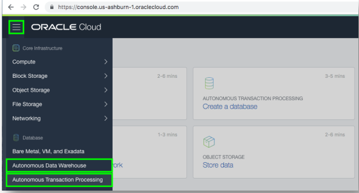

3. Click < **Your Database** > from the **list**

    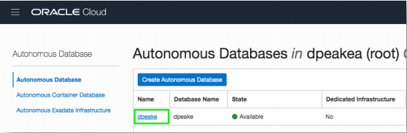

4. Click **Service Console**

    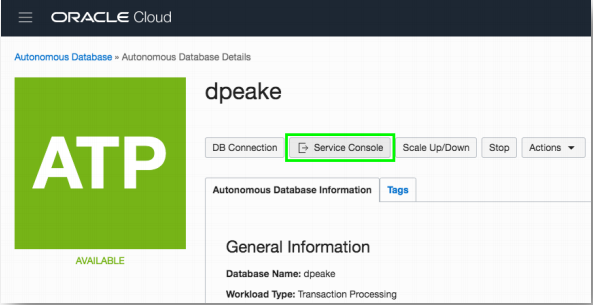

5. Click **Development**
6. Click **APEX**

    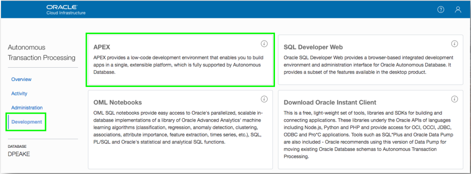

### **Part 2** - Creating a Workspace

1. To sign into **APEX Administrative Services** for Password enter your OCI Password
2. Click **Sign In** to Administration

    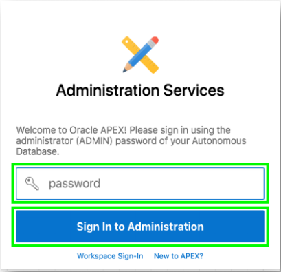

3. Given this is your first time entering APEX, click **Create Workspace**

    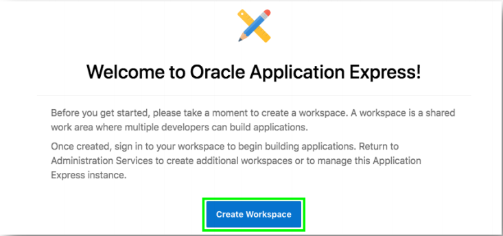

4. For **Database User** enter an appropriate name
5. Enter a **Password** {Click the ? Icon to see password complexity rules}
6. Click **Create Workspace**  

    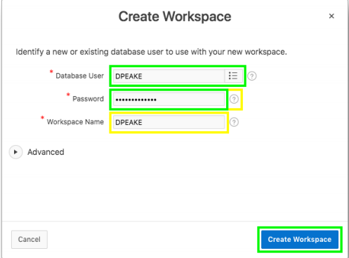  
    *{Note: The Database User will be used for the Workspace Name. If you want you can update the Workspace Name}*

### **Part 3** – Log into your New Workspace

1. Click on the link within the success message {easiest technique} OR
2. Click on the Admin user (top right), click **Sign Out**, and then click **Return to Sign In Page**

    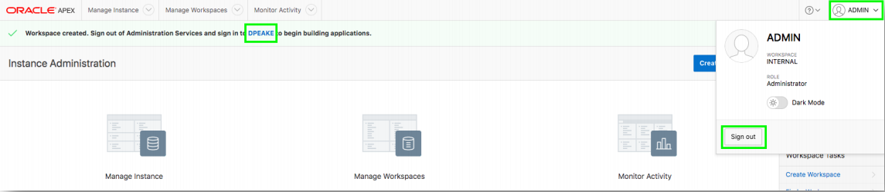

3. **Sign** into your new **Workspace**
    - Workspace – enter **Your Workspace Name**
    - Username – enter **Your Database User**
    - Password – enter your OCI Password  
    *Remember workspace and username - Check*
4. Click **Sign In** 

    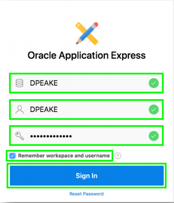  
    *{Note: Enter the Workspace Name and Database User entered in Part 2-6 above}*

5. Given this is your first time entering your new **Workspace**, click **Set APEX Account Password**

    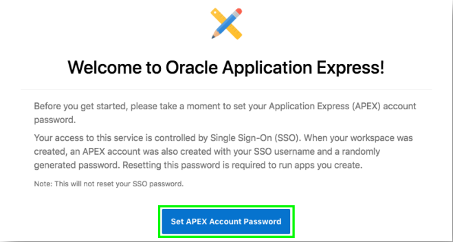

6. For your user profile enter the following:

    - Email Address – enter your email address
    - Enter New Password – enter your OCI Password
    - Confirm Password – enter your OCI Password
7. Click **Apply Changes**  
    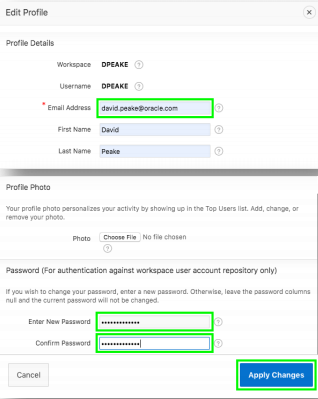

## Summary

This completes Module 1. At this point, you know how to log into your cloud account and create a APEX workspace. [Click here to navigate to Module 2](2-building-your-table-and-view-installing-sample-tables.md)
